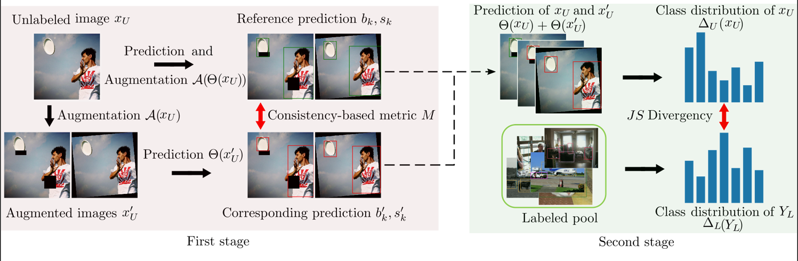
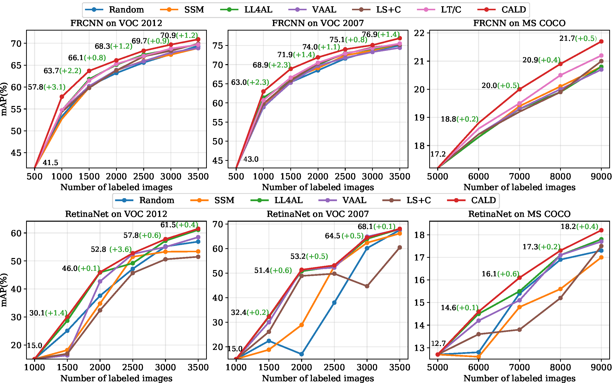

# Consistency-basd Active Learning for Object Detection

## Introduction
This repo is the official implementation of CALD: [**Consistency-basd Active Learning for Object Detection**](https://arxiv.org/abs/2103.10374)

. 

## Requirement
- pytorch>=1.7.1
- torch=0.8.2

(option if you want to get class-wise results of coco)

- mmcv=1.0.4
- pycocotools=2.0.2
- terminaltables=3.1.0
## Quick start
```
python cald_train.py --dataset voc2012 --data-path your_data_path --model faster
``` 
